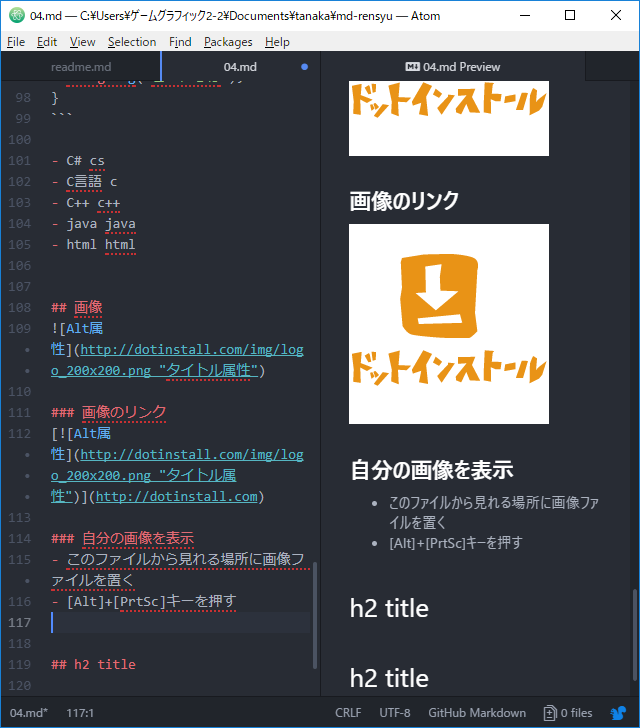

# h1 title

hello.  
hello. hello. hello. hello. hello. hello. hello. hello.

hello. hello. hello. hello. hello. hello. hello. hello. hello.

hello. hello. hello. hello. hello. hello. hello. hello. hello.

## 引用タグ
> quote. quote. quote. quote. quote. quote. quote. quote. quote. quote. quote. quote. quote. quote. quote.

## 区切り

---

***

___

- 上の文章に続けてしまうと、h2タグと解釈されてしまう。マークダウンでは、書式を設定する時、空行を入れておくとよい


h1 title
===

## 強調
斜体*斜体斜体*斜体斜体_斜体斜体_斜体斜体斜体斜体斜体斜体斜体

- 斜体は一般的には引用
- 日本語のWebフォントは斜体がない場合があるので注意

太字**太字太字**太字太字__太字太字__太字太字太字太字太字太字太字太字

- 太字は強調
- 日本語のフォントでも問題なく使える

## 箇条書き
- ハイフンで箇条書き

    インデント(字下げ)の段落インデント(字下げ)の段落インデント(字下げ)の段落インデント(字下げ)の段落インデント(字下げ)の段落インデント(字下げ)の段落

インデントなしの段落インデントなしの段落
インデントなしの段落
インデントなしの段落
インデントなしの段落

- 箇条書きのインデント
  - スペース2つで箇条書きをすると、インデント
    - 2つスペースを増やすごとに段が下がる


## 連番付きリスト
1. item1
1. item2
1. item3
1. **ピリオドの後に半角スペースが必要！**
  1. こちらもスペース2つ入れるごとに段を下げられる


## リンクの表現
URLそのままでもよいはず。

<http://dotinstall.com>

[ドットインストール](http://dotinstall.com)

[ドットインストール](http://dotinstall.com "これはドットインストールです")

[README](README.md)

    TODO: あとで動きを試す

## プログラムコード
- バッククォート(`)は、[Shift]+[@]キーで入力

```
function x() {
  return x;
}
```

    function x() {
      return x;
    }

この場合、`return x;`はどこに書くのでしょうか？

```html
<html>
</html>
```

```cs
// これはC#のコード
void Start() {
  Debug.Log("こんにちは");
}
```

- C# cs
- C言語 c
- C++ c++
- java java
- html html


## 画像


### 画像のリンク
[](http://dotinstall.com)

### 自分の画像を表示
- このファイルから見れる場所に画像ファイルを置く
- [Alt]+[PrtSc]キーを押す
- スタートから`mspaint`と入力して、ペイント起動
- [Ctrl]+[V]キーで貼り付け
- [Ctrl]+[Shift]+[X]キーでトリミングする
- [Ctrl]+[S]キーで保存
  - 場所は、ドキュメント -> 名前フォルダー -> md-rensyuフォルダー内に、img00.png という名前で保存



## テーブル(表)

|列見出し1|列見出し2|列見出し3|
|:---|:---:|---:|
|左揃え|中央揃え|右揃え|
|0|data|data|

- 1行目が行見出し
- 2行目に、列の揃えを指定。:とハイフン1つ以上
  - :--- 左揃え(:か-のみでも左揃え)
  - :---: 中央揃え
  - ---: 右揃え
- 3行目以下が、データ行


## h2 title

h2 title
---


###### h6 title
